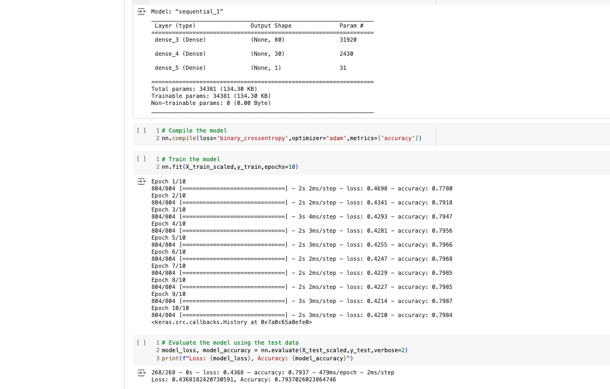

# Deep Learning Challenge

## Table of Contents
- [Installation](#installation)
- [Usage](#usage)
- [Overview](#overview)
- [Data Preprocessing](#data-preprocessing)
- [Compiling, Training, and Evaluating the Model](#compiling-training-and-evaluating-the-model)
- [Summary](#summary)
- [Alternative Model Recommendation](#alternative-model-recommendation)
- [Contact](#contact)

## Installation
Tensorflow, pandas, python

## Usage
Run the AlphabetSoupCharity.ipnb file to obtain the model. 

## Overview
I created a deep learning model for a nonprofit foundation, Alphabet Soup, to use as a tool to help it select the applicants with the best chance of success in their ventures, when considering which to fund. The analysis uses the features in a CSV provided by the Alphabet Soup's business team, using the features from the dataset to predict whether applicants will be successful if funded by Alphabet Soup.

## Data Preprocessing
+ "y" variable for "IS SUCCESSFUL" is the target for my model.
+ "X" is holding the features of the model for all the columns other than "IS SUCCESSFUL."
+ The variables that should be removed are "EIN" and "NAME."

## Compiling, Training and Evaluating the Model
- I selected 3 layers and 2 activation functions.
    - input layer (layer 1) had 80 neurons and activation function "relu"
    - hidden layer (layer 2) had 30 neurons and activation function "relu"
    - output layer (layer 3) had 1 neuron and activation function "SIGMOID"
    - This combination provided the target score.
- The target model perfomance was achieved with a score of 79%.

## Summary
After optimizing the model with my knowledge of machine learning and neural networks, I created a binary classifier that can predict whether applicants will be successful in their ventures, if funded by the nonprofit foundation Alphabet Soup. 

Using the csv provided by the Alphabet Soup's business team, which contains more than 34,000 organizations that have received funding from Alphabet Soup over the years (and whether they were successful in their ventures), I trained a deep learning model using TensorFlow and Keras. The model obtained a predictive score of 79% accuracy, which Alphabet Soup can now use as a tool to be more selective when considering applicants for funding, to focus their funding on organizations that show the higher chances of success.

## Alternative Model Recommendation
Alternatively, a Random Forest Classifier could be used for handling categorical variables.
